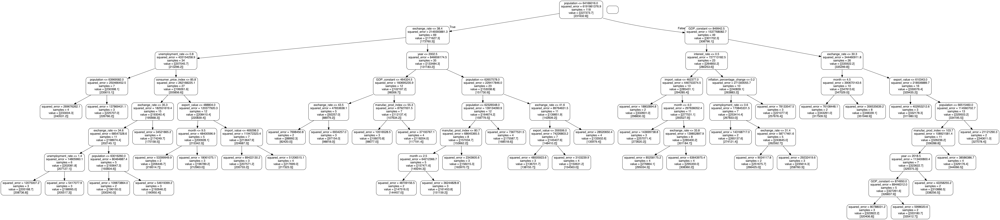

# Container forcast using raindom forest model

In this project, we aims the build a prediction model for container throughput in Thailand port. 

We first load all the data collected throughout year 2001-2021. This included inbound and outbound container throughput. As for the features, we use features as follows

- Consumer price index
- Export value
- Import value
- GDP constant
- Inflation rate
- Interest rate
- Manufacture product index
- Population
- Unemployment rate
- USD to THB conversion rate


```python
import numpy as np
import pandas as pd
```

# Loading label for model prediction


```python
month_to_int = {'January':1, 'February':2, 'March':3, 'April':4, 'May':5, 
'June':6, 'July':7, 'August':8, 'September':9, 'October':10, 'November':11, 'December':12}


labels_df = pd.read_csv("container_throughput_label.csv")
labels_df['month'] = labels_df['month'].map(lambda x: month_to_int[x])

labels_df.head()

```


<div>
<style scoped>
    .dataframe tbody tr th:only-of-type {
        vertical-align: middle;
    }

    .dataframe tbody tr th {
        vertical-align: top;
    }

    .dataframe thead th {
        text-align: right;
    }
</style>
<table border="1" class="dataframe">
  <thead>
    <tr style="text-align: right;">
      <th></th>
      <th>year</th>
      <th>month</th>
      <th>inbound</th>
      <th>outbound</th>
    </tr>
  </thead>
  <tbody>
    <tr>
      <th>0</th>
      <td>2001</td>
      <td>1</td>
      <td>91751</td>
      <td>82123</td>
    </tr>
    <tr>
      <th>1</th>
      <td>2001</td>
      <td>2</td>
      <td>83475</td>
      <td>83014</td>
    </tr>
    <tr>
      <th>2</th>
      <td>2001</td>
      <td>3</td>
      <td>95149</td>
      <td>95933</td>
    </tr>
    <tr>
      <th>3</th>
      <td>2001</td>
      <td>4</td>
      <td>86302</td>
      <td>91967</td>
    </tr>
    <tr>
      <th>4</th>
      <td>2001</td>
      <td>5</td>
      <td>96431</td>
      <td>101828</td>
    </tr>
  </tbody>
</table>
</div>


# Load features for model prediction


```python
features_df = pd.read_csv("features.csv")
features_df = features_df.drop('id', axis=1)


features_df['month'] = features_df['month'].map(lambda x: month_to_int[x])
features_df = features_df.interpolate(axis=0)

features_df.head()
```


<div>
<style scoped>
    .dataframe tbody tr th:only-of-type {
        vertical-align: middle;
    }

    .dataframe tbody tr th {
        vertical-align: top;
    }

    .dataframe thead th {
        text-align: right;
    }
</style>
<table border="1" class="dataframe">
  <thead>
    <tr style="text-align: right;">
      <th></th>
      <th>year</th>
      <th>month</th>
      <th>export_value</th>
      <th>GDP_constant</th>
      <th>import_value</th>
      <th>inflation_percentage_change</th>
      <th>interest_rate</th>
      <th>manufac_prod_index</th>
      <th>population</th>
      <th>unemployment_rate</th>
      <th>exchange_rate</th>
      <th>consumer_price_index</th>
    </tr>
  </thead>
  <tbody>
    <tr>
      <th>0</th>
      <td>2001</td>
      <td>1</td>
      <td>279973.0</td>
      <td>459359.0</td>
      <td>255061.0</td>
      <td>0.72</td>
      <td>2.5</td>
      <td>52.47</td>
      <td>62308887.0</td>
      <td>5.73</td>
      <td>43.12</td>
      <td>68.8</td>
    </tr>
    <tr>
      <th>1</th>
      <td>2001</td>
      <td>2</td>
      <td>279973.0</td>
      <td>459359.0</td>
      <td>255061.0</td>
      <td>0.44</td>
      <td>2.0</td>
      <td>53.02</td>
      <td>62308887.0</td>
      <td>4.25</td>
      <td>42.64</td>
      <td>69.1</td>
    </tr>
    <tr>
      <th>2</th>
      <td>2001</td>
      <td>3</td>
      <td>279973.0</td>
      <td>459359.0</td>
      <td>255061.0</td>
      <td>0.00</td>
      <td>2.0</td>
      <td>52.18</td>
      <td>62308887.0</td>
      <td>4.04</td>
      <td>43.90</td>
      <td>69.1</td>
    </tr>
    <tr>
      <th>3</th>
      <td>2001</td>
      <td>4</td>
      <td>283056.0</td>
      <td>442241.0</td>
      <td>255379.0</td>
      <td>0.72</td>
      <td>2.0</td>
      <td>51.29</td>
      <td>62308887.0</td>
      <td>4.06</td>
      <td>45.46</td>
      <td>69.6</td>
    </tr>
    <tr>
      <th>4</th>
      <td>2001</td>
      <td>5</td>
      <td>283056.0</td>
      <td>442241.0</td>
      <td>255379.0</td>
      <td>0.29</td>
      <td>2.0</td>
      <td>52.51</td>
      <td>62308887.0</td>
      <td>4.24</td>
      <td>45.48</td>
      <td>69.8</td>
    </tr>
  </tbody>
</table>
</div>


## Generate Training and Testing set


```python
from sklearn.ensemble import RandomForestRegressor
from sklearn.model_selection import RandomizedSearchCV, GridSearchCV, train_test_split
from sklearn.metrics import mean_absolute_error, mean_squared_error, mean_absolute_percentage_error
from sklearn.tree import export_graphviz
import pydot
```


```python
# Convert pandas dataframe to numpy array
feature_list = list(features_df.columns)
features = np.array(features_df)
labels = np.array(labels_df.drop(['year','month'], axis=1))
# Split data into training and testing set with 25% of test set
train_features, test_features, train_labels, test_labels = train_test_split(features, 
                                                            labels, test_size=0.25, random_state=42)

```

# Create Random forest model


```python
# Create set of parameters to perform parameter optimization
# n_estimators = [int(x) for x in np.linspace(10000, 50000, num=3)]
n_estimators = [900]
max_features = ['log2', 'sqrt', None]
max_depth = [int(x) for x in np.linspace(1, 100, num = 5)]
max_depth.append(None)
min_samples_split = [2, 5, 10]
min_samples_leaf = [1, 2, 4]
bootstrap = [True, False]
random_state = [int(x) for x in np.linspace(0, 50, num=5)]

random_grid = {'n_estimators': n_estimators,
               'max_features': max_features,
               'max_depth': max_depth,
               'min_samples_split': min_samples_split,
               'min_samples_leaf': min_samples_leaf,
               'bootstrap': bootstrap,
               'random_state': random_state}

print(random_grid)
```

    {'n_estimators': [900], 'max_features': ['log2', 'sqrt', None], 'max_depth': [1, 25, 50, 75, 100, None], 'min_samples_split': [2, 5, 10], 'min_samples_leaf': [1, 2, 4], 'bootstrap': [True, False], 'random_state': [0, 12, 25, 37, 50]}


# Train model


```python
%timeit
# Random search of parameters, using 3 fold cross validation, 
rf = RandomForestRegressor()
rf_random = RandomizedSearchCV(estimator = rf, param_distributions = random_grid, n_iter = 100, 
                            cv = 3, scoring = 'neg_mean_absolute_error', verbose=1, 
                            random_state=42, n_jobs = -1)


# Fit the random search model
rf_random.fit(train_features, train_labels)
rf_random.best_params_
```

    Fitting 3 folds for each of 100 candidates, totalling 300 fits


    {'random_state': 50,
     'n_estimators': 900,
     'min_samples_split': 5,
     'min_samples_leaf': 2,
     'max_features': 'log2',
     'max_depth': 75,
     'bootstrap': True}


```python
best_model = rf_random.best_estimator_
best_model.fit(train_features, train_labels)
predictions = best_model.predict(test_features)
```


```python
# Print evaluation metric
print(f'Mean Absolute Error (MAE): {mean_absolute_error(test_labels, predictions)}')
print(f'Mean Squared Error (MSE): {mean_squared_error(test_labels, predictions)}')
print(f'Root Mean Squared Error (RMSE): {np.sqrt(mean_absolute_error(test_labels, predictions))}')
print(f'Mean Absolute Percentage Error (MAPE): {mean_absolute_percentage_error(test_labels, predictions)}')
```

    Mean Absolute Error (MAE): 14946.331758365259
    Mean Squared Error (MSE): 383561103.8205525
    Root Mean Squared Error (RMSE): 122.2551911305416
    Mean Absolute Percentage Error (MAPE): 0.06523886339257695


# Show a tree in Random forest


```python
tree = best_model.estimators_[0]
export_graphviz(tree, out_file = 'tree.dot', feature_names = feature_list, rounded = True, precision = 1)

(graph, ) = pydot.graph_from_dot_file('tree.dot')
graph.write_png('tree.png')

```


